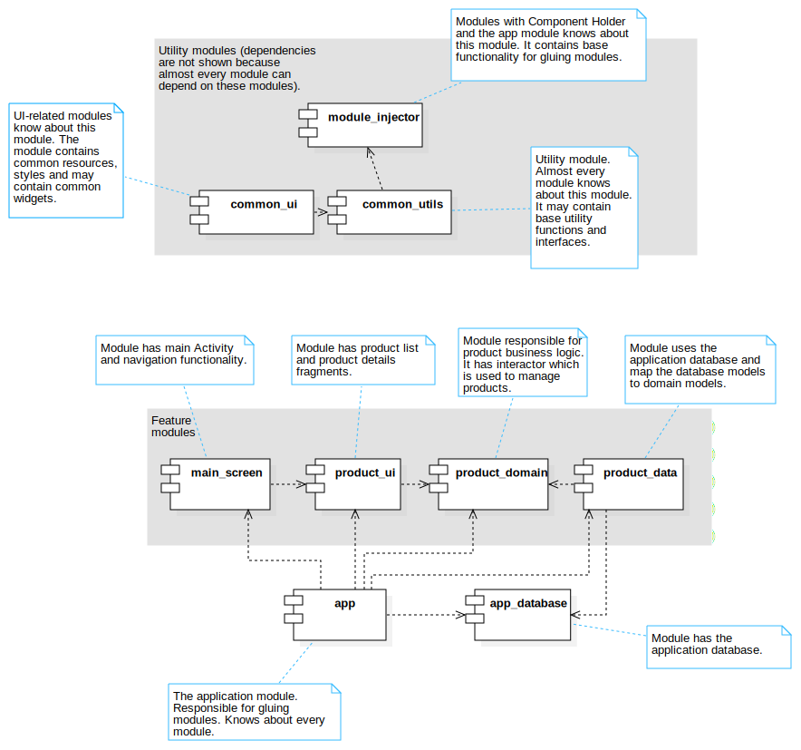

# ProductList

The sample application.

Main used technoliges/libraries: 
Kotlin Coroutines, Dagger 2, Glide, Gson, NavComponent, MVIKotlin, Room DB, Junit5, Mockk.

Multimodule architecture approach is based on the publication: https://proandroiddev.com/modularization-of-android-applications-with-lazy-initialization-a091eaaa284a

The component diagram:

